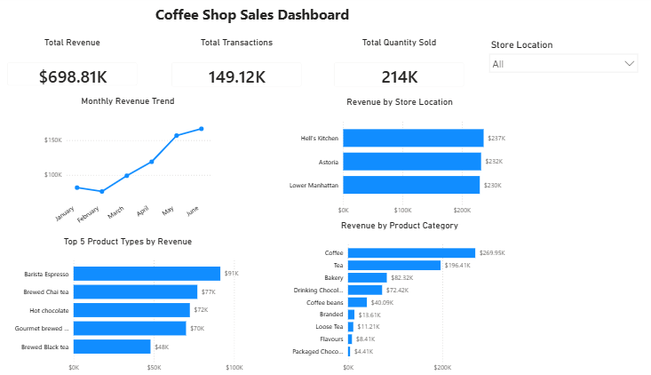

# Coffee Shop Sales Analysis

## Project Overview

This project analyzes coffee shop transaction data to understand sales
trends, store performance, product performance, and differences between
weekday and weekend purchasing patterns.

The project was completed using **SQLite** for data exploration and
analysis and **Power BI** for data visualization.

### Key Metrics

-   **Total Revenue:** \$698.81K
-   **Total Transactions:** 149.12K
-   **Total Quantity Sold:** 214K
-   **Store Locations:** 3
-   **Analysis Period:** January--June 2023

------------------------------------------------------------------------

## Business Questions

The analysis focuses on the following questions:

1.  How did sales performance change from January to June?
2.  Which store locations generated the most revenue?
3.  Which product categories and product types contributed the most
    revenue?
4.  Did weekday and weekend purchasing patterns differ?
5.  Which products helped explain differences in daily revenue?

------------------------------------------------------------------------

## Dataset

The dataset contains transaction-level coffee shop sales data,
including:

-   Transaction date
-   Transaction quantity
-   Unit price
-   Store location
-   Product category
-   Product type
-   Product detail

A standardized date field was created in SQL to support monthly and
weekday/weekend analysis.

------------------------------------------------------------------------

## Tools Used

-   **SQLite** --- data exploration, cleaning, aggregation, and deeper
    analysis
-   **Power BI** --- dashboard creation and visualization
-   **DAX** --- supporting calculations in Power BI

------------------------------------------------------------------------

## Data Preparation

Before analysis, the dataset was checked for basic structure and date
formatting.

The original `transaction_date` field required standardization for
date-based SQL analysis. A `clean_date` field in `YYYY-MM-DD` format was
therefore created.

Revenue was calculated as:

`Revenue = Transaction Quantity × Unit Price`

The cleaned date was then used to analyze monthly trends and classify
transactions into **Weekday** and **Weekend** groups.

------------------------------------------------------------------------

## SQL Analysis

The SQL analysis covered several areas:

### Sales Trends

Monthly revenue was calculated to identify changes in sales performance
over time. Average daily revenue was also analyzed to avoid interpreting
monthly totals only through differences in the number of calendar days.

### Store Performance

Revenue and quantity sold were compared across the three store locations
and by month.

### Product Performance

Product categories and product types were compared using revenue,
quantity sold, and average unit price.

### Weekday vs Weekend Analysis

Average daily revenue was compared between weekdays and weekends. The
analysis was then broken down by product category to investigate
differences in the sales mix.

The complete SQL analysis is available in
[`sql/coffee_shop_analysis.sql`](sql/coffee_shop_analysis.sql).

------------------------------------------------------------------------

## Power BI Dashboard



The dashboard provides an overview of:

-   Total revenue
-   Total transactions
-   Total quantity sold
-   Monthly revenue trend
-   Revenue by store location
-   Revenue by product category
-   Top 5 product types by revenue
-   Store location filtering

------------------------------------------------------------------------

## Key Insights

### 1. Sales strengthened substantially toward the end of the period

Total monthly revenue decreased slightly from January to February, then
increased consistently from March through June.

Average daily revenue also increased from approximately **\$2.63K in
January to \$5.55K in June**, showing that the upward trend was not
simply caused by differences in the number of days per month.

### 2. Store performance was relatively balanced

**Hell's Kitchen** generated the highest overall revenue at
approximately **\$237K**, followed by **Astoria (\$232K)** and **Lower
Manhattan (\$230K)**.

The relatively small gap between the three locations suggests that the
overall sales increase was not driven by only one store.

### 3. Coffee and Tea were the main revenue-driving categories

**Coffee generated approximately \$270K** and **Tea approximately
\$196K**, making them the two largest revenue contributors.

At the product-type level, **Barista Espresso** generated the highest
revenue at approximately **\$91K**, followed by **Brewed Chai Tea
(\$77K)** and **Hot Chocolate (\$72K)**.

### 4. Overall weekday and weekend performance was very similar

Across the full analysis period, average daily revenue was approximately
**\$3.87K on weekdays** and **\$3.85K on weekends**, indicating little
overall difference.

However, deeper monthly analysis showed that the product mix could
differ even when total daily revenue was similar.

### 5. June showed a notable weekend product-mix effect

In June, weekend average daily revenue was higher than weekday average
daily revenue (**about \$5.63K vs. \$5.52K**).

Average quantity sold per day was only slightly higher on weekends, but
categories such as **Tea, Drinking Chocolate, Coffee Beans, and Branded
products** contributed to the difference.

Coffee Beans were particularly notable: the average weekend quantity was
only about **1.48 units per day higher**, but because the category had a
relatively high average unit price of around **\$21**, it contributed
more than **\$90 additional daily revenue** on weekends.

------------------------------------------------------------------------

## Conclusion

The analysis shows strong sales growth from March to June, with
relatively balanced performance across all three store locations. Coffee
and Tea were the largest revenue contributors, while Barista Espresso
was the leading product type by revenue.

The weekday/weekend analysis also demonstrates that similar overall
revenue can hide differences in product mix. Looking beyond total
revenue and examining quantity, price, and category-level performance
provides a clearer explanation of sales patterns.

------------------------------------------------------------------------

## Repository Structure

``` text
coffee-shop-sales-analysis/
│
├── README.md
├── sql/
│   └── coffee_shop_analysis.sql
├── dashboard/
│   └── coffee_shop_dashboard.pbix
└── images/
    └── dashboard.png
```
